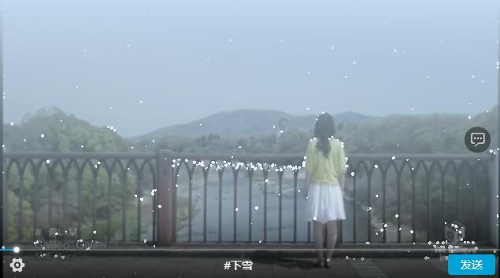

comming soon...
# danmaku-player [](https://www.npmjs.com/package/danmaku-player) 
Demo located at https://dwqdaiwenqi.github.io/danmaku-player/site/





### HTML
```html
  <script src="//unpkg.com/danmaku-player@latest/dist/scripts/danmaku-player.min.js"></script>
  <danmaku-player id="player" 
    thumbnail="//static.xyimg.net/cn/static/fed/common/img/thumbnail-tile-90X1-scale-160X90.png" 
    thumbnailtile="90"
    danmakuapi="//static.xyimg.net/cn/static/fed/common/danmaku-list.json"
    poster="//static.xyimg.net/cn/static/fed/common/img/poster.jpg" 
    src="//static.xyimg.net/cn/static/fed/common/media/Galileo180.mp4"></danmaku-player>
  <script>
    var $player = document.querySelector('#player')
    $player.addEventListener('ended', () => {
      //...
    })
    $player.addEventListener('play', () => {
      //...
    })
 
  </script>
```
