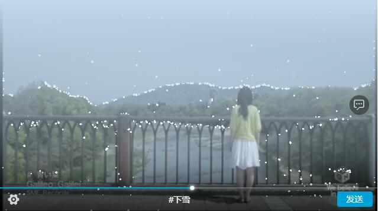
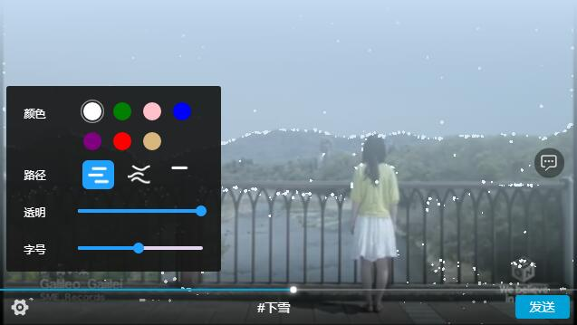

# danmaku-player [](https://www.npmjs.com/package/danmaku-player) 
融合了WebGl和Web Componet的实时图像处理弹幕播放器

## 特征
* 基于Web Components ，拥抱Web Components标准，内部使用的 [omi](https://github.com/Tencent/omi) 作为开发Web Components的开发框架，[omi](https://github.com/Tencent/omi)是个非常棒的现代框架，强力推荐！
* 高性能的，使用WebGl进行渲染，同频弹幕数达到5000+，fps依旧坚挺
* 想比传统的弹幕显示运动方式，添加了曲线模式的弹幕发送 
* 内置实时图像处理的特效指令（切勿在全屏模式下使用），当前有#护眼、#下雪等 - 未来将支持更多的特效指令

→ Demo located at https://dwqdaiwenqi.github.io/danmaku-player/example/    

## 截图






## Usage
通过npm或者cdn获取
```js
npm i danmaku-player
```
* [https://unpkg.com/danmaku-player@latest/dist/scripts/danmaku-player.js](https://unpkg.com/danmaku-player@latest/dist/scripts/danmaku-player.js)

### HTML
用法和`<video/>`标签差不多，直接写入到html中即可
```html
  <script src="//unpkg.com/danmaku-player@latest/dist/scripts/danmaku-player.min.js"></script>
  <danmaku-player id="player" 
    thumbnail="//static.xyimg.net/cn/static/fed/common/img/thumbnail-tile-90X1-scale-160X90.png" 
    thumbnailtile="90"
    danmakuapi="//static.xyimg.net/cn/static/fed/common/danmaku-list.json"
    poster="//static.xyimg.net/cn/static/fed/common/img/poster.jpg" 
    src="//static.xyimg.net/cn/static/fed/common/media/Galileo180.mp4"></danmaku-player>
  <script>
    var $player = document.querySelector('#player')
    $player.addEventListener('ended', () => {
      //...
    })
    $player.addEventListener('play', () => {
      //...
    })
 
  </script>
```
### React
```js
import 'danmaku-player'
//...
render(){
  // react中需要用ref获取到原生dom对象
    return(
      <section>
        <danmaku-player ref={el=>this.$player=el}src="//static.xyimg.net/cn/static/fed/common/media/Galileo180.mp4"></danmaku-player>
      </section>
    )
 }
 componentDidMount(){
  this.$player.addEventListener('play',()=>{
    //...
  })
  //...
 }
```
### 特效指令
特效指令#xxx，第一次输入#xxx开启了特效，再次输入#xxx关闭特效。目前有#下雪，更多指令待开发...

### 属性
| 属性     | 描述  | 
| :------------- | :------------- | 
| src         | 必须，视频的播放地址，目前支持mp4      | 
| poster         | 不必须，视频海报      | 
| autoplay         | 不必须，      | 
| playbackrate         | 不必须，      | 
| loop         | 不必须，      |
| volumn     | 不必须，      | 

### 事件
| 事件名     | 描述  | 
| :------------- | :------------- | 

### 你想问
#### 为什么不要在全屏模式下使用#xxx特效指令
当调用特效指令，如：#下雪，播放器的渲染就不使用`<video/>`了，而是切换成`<canvas/>`获取WebGl对象进行渲染。在全屏模式下，WebGl渲染了面积过大的实时视频纹理导致了fps下降，目前无解（有好的解决方法的务必告知~）
#### 移动端没做处理吗
对，自动播放和全屏这两个问题移动浏览器没解决，暂时不考虑兼容移动端
#### 属性和事件和原生的video一致吗
不完全一致，虽然很多事件和属性名相同，但是都是经过包装过的
#### 视频的缩略图怎么获得
下载个ffmpeg软件，然后执行命令 ``,就生成想要的缩略图了


## 待完成...

## comming soon ......

## License

MIT
